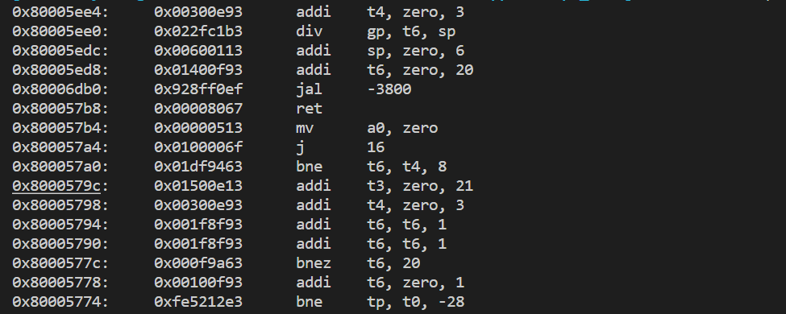

## Lab2 Report
**PB21050996**
**徐航宇**

#### 1
>Q:需要被我们的 CPU 执行的程序是如何被指定的？build.mk 中哪个参数规定了这个程序的路径？main 函数是通过什么方法获得这个参数的？
A:
- 由`load_img(argv[1])`将要执行的程序载入CPU中。
- build.mk中参数$(IMG)决定了该路径，该参数从`./software/base-port/Makefile`中传递而来，对应参数为`IMAGE`，有`IMAGE ?= $(BUILD_DIR)/$(NAMES)-riscv32`，$(NAMES)定义于`./software/functest/Makefile`中。
- main 函数是通过`main(int argc, char** argv, char** env)`获得这个参数的，其中，build.mk 中运行main的指令为`$(VBIN) $(IMG) $(NEMUISO) $(ARGS)`。

#### 2
>Q:请结合寄存器堆的实现代码和仿真环境代码，简述仿真环境是如何访问到寄存器堆中的值的。
A:
- 寄存器堆`regs`通过函数`isa_reg_str2val`映射到对应的值`cpu_gpr`，而`cpu_gpr`可由函数`set_gpr_ptr`中被`cpu_gpr = (uint32_t *)(((VerilatedDpiOpenVar*)r)->datap());`设置
- 在寄存器堆的实现代码中，语句`import "DPI-C" function void set_gpr_ptr(input logic [31 : 0] a []);`将对应寄存器堆的值的指针传递给仿真环境。

#### 3
>Q:你是如何设计指令踪迹的输出格式的？你觉得踪迹中哪些信息对于你后续的 debug 是有意义的？
A:
 

如图。我觉得踪迹中指令、十六进制码及其地址都是有意义的。

#### 4
>Q:你对本次实验有什么意见或建议？
>A:无。